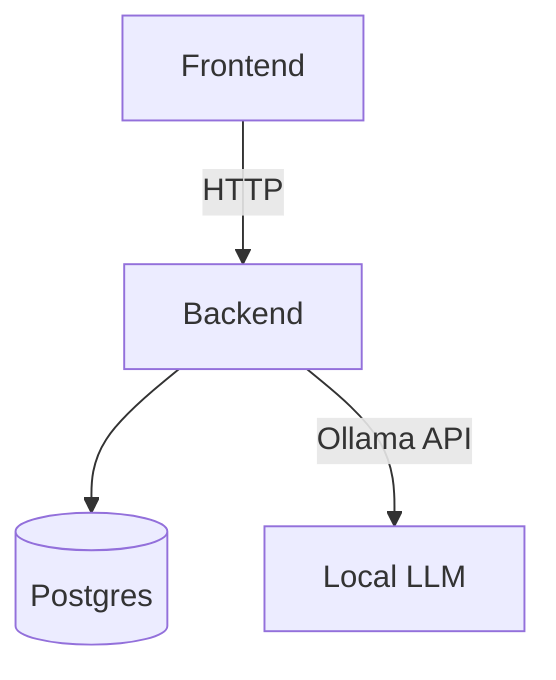
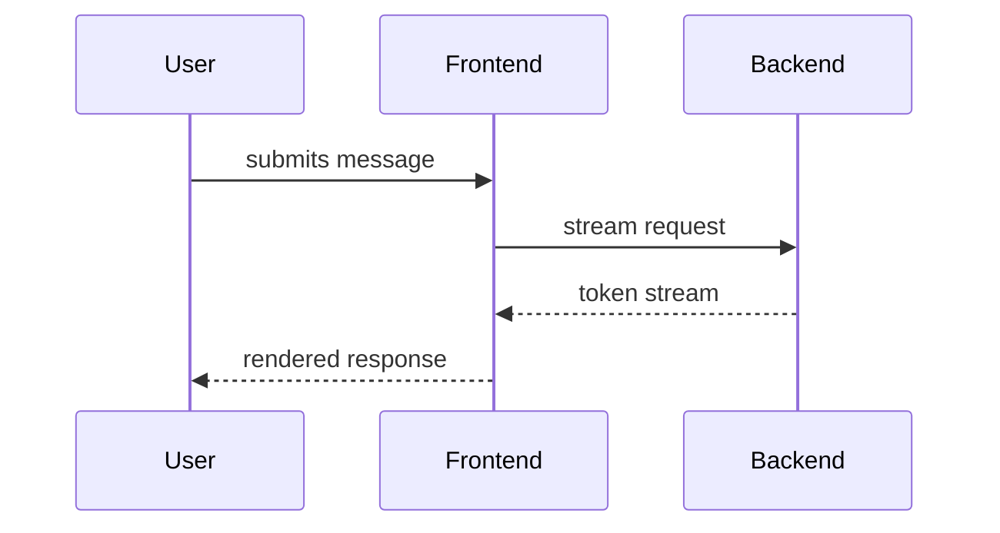
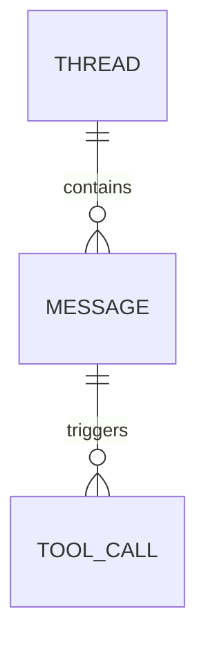
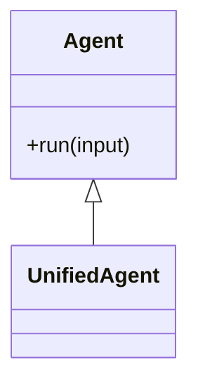
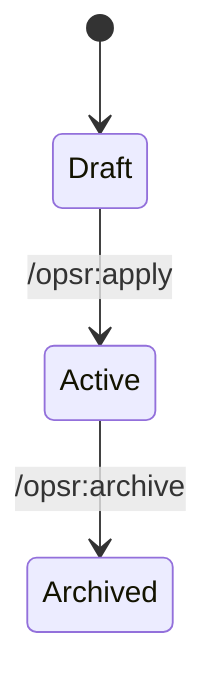

# Diagram Creator

## When to reach for a diagram

Consider a Mermaid diagram whenever the answer is naturally a graph, not a list:

- **Architecture** — how components, services, or files connect (e.g. "how do the frontend, backend, and database talk to each other").
- **Flow / process** — a multi-step decision or pipeline with branches (e.g. approval flows, build pipelines, request lifecycles).
- **Sequence** — an ordered exchange of calls between actors over time (e.g. client → API → database → response).
- **Relationships** — entities and how they relate (e.g. database schema, class hierarchy, state machine).

If the explanation is a short, linear list of steps with no branching or interacting parts, plain prose is usually clearer — don't force a diagram where a sentence already does the job.

## Output format

Emit the diagram as a fenced code block opened with ` ```mermaid ` and closed with ` ``` `, containing valid Mermaid syntax. This is plain response text: **no tool call, no approval gate** — it renders like any other code block, the same as a ```python snippet.

Pick the diagram type that matches the shape of the answer:

| Situation | Mermaid type |
|---|---|
| Components and their connections | `flowchart` (or `graph`) |
| Ordered calls between actors over time | `sequenceDiagram` |
| Database schema / entity relationships | `erDiagram` |
| Class hierarchy / object structure | `classDiagram` |
| Finite states and transitions | `stateDiagram-v2` |

## Syntax primer

Keep syntax simple and valid — the frontend renders this client-side and falls back to a plain code view if `mermaid.render()` fails, so a broken diagram degrades to unreadable text rather than crashing anything, but a valid one is strictly better.

**flowchart** — nodes and directed edges:



**sequenceDiagram** — ordered messages between participants:



**erDiagram** — entities and cardinality:



**classDiagram** — types and relationships:



**stateDiagram-v2** — states and transitions:



## Rules of thumb

- One diagram per concept — don't cram architecture, sequence, and state into a single flowchart. Emit separate blocks if multiple angles are genuinely useful.
- Label edges when the relationship isn't obvious from the node names alone (protocol, event name, condition).
- Prefer short node labels; move detailed explanation to surrounding prose, not into the diagram.
- If unsure whether a construct is valid Mermaid syntax, prefer the simpler, well-established form (basic `flowchart`/`sequenceDiagram` shapes) over an exotic feature — the fallback is a raw code block, not a retry, so getting it right the first time matters more than being fancy.
