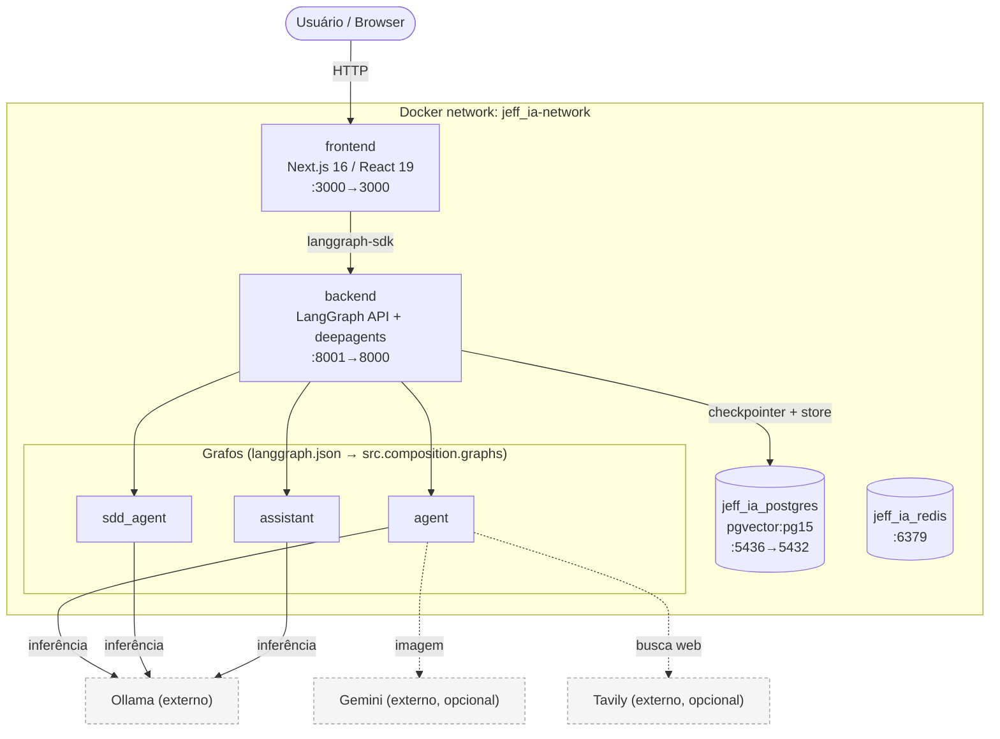

# Arquitetura Jeff AI — Documento de Referência (Baseline as-is)

> **Fonte da verdade:** artefato `arquitetura-jeff-ai-baseline` no OpenSddRag (projeto `jeff-ai`),
> sempre atualizado pelo fluxo SDD. Este arquivo é um **espelho versionado em git** — se ele
> divergir do baseline, deve ser atualizado para refleti-lo.
> Produzido pela mudança `mapear-arquitetura-projeto`; Seção 6 pela `adotar-ddd-clean-architecture`.
>
> **Seções:** 1. Agentes e Grafos LangGraph · 2. Persistência e Backends ·
> 3. Diagrama de Componentes · 4. Integrações e Modelos · 5. Riscos e Dívidas Técnicas ·
> 6. Arquitetura em Camadas (Clean Architecture + DDD).

## 1. Agentes e Grafos LangGraph

O sistema registra **dois grafos** LangGraph em [backend/langgraph.json](../backend/langgraph.json) (chave `graphs`), ambos
construídos com `create_deep_agent` da biblioteca `deepagents`:

```json
"graphs": {
  "agent": "src.agents.requirements_specialist:agent",
  "sdd_agent": "src.agents.sdd.orchestrator:sdd_agent"
}
```

### 1.1 Grafo `agent` — Gerador de Documentos de Requisitos
Arquivo: [backend/src/agents/requirements_specialist.py](../backend/src/agents/requirements_specialist.py)

| Aspecto | Detalhe | Referência |
|---------|---------|------------|
| Papel | Agente **orquestrador**; nunca implementa código diretamente | `requirements_specialist.py:39-72` |
| Modelo | `ollama_model` | `requirements_specialist.py:6,40` |
| Subagentes | `fullstack_subagent`, `image_design_subagent` | `requirements_specialist.py` |
| Ferramentas | `merge_generated_files`, `get_date_time_current` | `requirements_specialist.py` |
| Skills | `/skills/` | `requirements_specialist.py` |
| Saída | `backend/outputs/{thread_id}/` (arquivo consolidado obrigatório via `merge_generated_files`) | `requirements_specialist.py` |
| Recursion limit | 1000 | `requirements_specialist.py` |

**Fluxo de orquestração** (do system_prompt):
1. Analisa o pedido do usuário.
2. Usa `write_todos` para criar tarefas (cada sessão do documento = uma tarefa).
3. Delega cada tarefa via `task(name="fullstack_subagent", task="...")`.
4. Consolida os resultados e usa **obrigatoriamente** `merge_generated_files` para unificar, na ordem.
5. Salva o arquivo final em `backend/outputs/`.

**Subagente `fullstack_subagent`** ([backend/src/agents/subagents/fullstack.py](../backend/src/agents/subagents/fullstack.py)):
escritor técnico que cria seções de documento de requisitos (`ls`, `read_file`, `write_file`).

### 1.2 Grafo `sdd_agent` — Pipeline SDD (spec-kit)
Arquivo: [backend/src/agents/sdd/orchestrator.py](../backend/src/agents/sdd/orchestrator.py)

Orquestrador de um **pipeline de 7 fases**, cada fase delegada a um subagente via `task()`:

```
1. CONSTITUTION → 2. SPECIFY → 3. CLARIFY → 4. PLAN → 5. ANALYZE → 6. TASKS → 7. IMPLEMENT
```

| Fase | Subagente | Módulo |
|------|-----------|--------|
| 1. Constitution | `constitution_subagent` | `sdd/subagents/constitution.py` |
| 2. Specify | `specify_subagent` | `sdd/subagents/specify.py` |
| 3. Clarify | `clarify_subagent` | `sdd/subagents/clarify.py` |
| 4. Plan | `plan_subagent` | `sdd/subagents/plan.py` |
| 5. Analyze | `analyze_subagent` | `sdd/subagents/analyze.py` |
| 6. Tasks | `tasks_subagent` | `sdd/subagents/tasks.py` |
| 7. Implement | `implement_subagent` | `sdd/subagents/implement.py` |

Ferramentas: `create_feature_directory`, `load_template`, `validate_artifact`, `get_sdd_state`,
`get_next_feature_number`. Saída em `outputs/.specify/` (`memory/constitution.md` global +
`specs/{NNN}-{feature}/`). Recursion limit 1000.

**Regras-chave:** o orquestrador nunca escreve artefatos diretamente (delega via `task()`); a
constitution é global; cada subagente de fase é stateless; há um loop de validação após ANALYZE.

> **Nota (pós-`adotar-ddd-clean-architecture`):** há também um terceiro grafo `assistant`
> ([backend/src/agents/assistant/agent.py](../backend/src/agents/assistant/agent.py)), e o `langgraph.json` passou a expor os grafos via
> `src.composition.graphs:<graph>` (os `graph_id` foram preservados). Ver Seção 6.

## 2. Persistência e Backends

**Duas camadas independentes:** (a) persistência do LangGraph API (checkpointer + store) e
(b) roteamento de filesystem virtual dos agentes via `CompositeBackend`.

### 2.1 Checkpointer e Store (Postgres / pgvector)
Configurados **declarativamente** em [backend/langgraph.json](../backend/langgraph.json), ambos via `POSTGRES_URI`:

```json
"checkpointer": { "type": "postgres", "url": "${env:POSTGRES_URI}" },
"store":        { "type": "postgres", "url": "${env:POSTGRES_URI}" }
```

- **Checkpointer** — histórico/estado do grafo por `thread_id`.
- **Store** — memória de longo prazo (namespace `/memories/`), com busca vetorial pgvector.

> Os agentes **não** instanciam `PostgresSaver` manualmente — o LangGraph API gerencia isso.

### 2.2 CompositeBackend — sistema de arquivos virtual dos agentes
Cada grafo obtém uma `backend_factory(rt)` que monta um `CompositeBackend` (de
`deepagents.backends`) roteando caminhos por thread (`thread_id` via `get_config()`):

- **`agent`** — `default` (`StateBackend`), `{OUTPUTS_DIR}` (`backend/outputs/{thread_id}`), `/skills/`, `/memories/` (`StoreBackend`).
- **`sdd_agent`** — `default`, `{SPECIFY_DIR}` (`outputs/.specify`), `{TEMPLATES_DIR}` (`templates/sdd`), `/skills/`, `/memories/`.
- **`assistant`** — `default`, `{WORKSPACE_DIR}` (`workspace/{thread_id}`), `/skills/` (sem `/memories/`).

> **Resolvido (`adotar-ddd-clean-architecture`):** a `backend_factory`, antes duplicada entre os
> orquestradores (antigo R4), foi unificada em [backend/src/composition/backends.py](../backend/src/composition/backends.py)
> (`make_backend_factory` + `FsRoute`); os três grafos a consomem. Ver Seção 6.

### 2.3 Variáveis de ambiente
Carregadas via `load_dotenv()` a partir de `backend/.env`.

| Variável | Obrigatória | Uso |
|----------|-------------|-----|
| `POSTGRES_URI` | ✅ | Checkpointer + Store (`langgraph.json`) |
| `OLLAMA_BASE_URL` | ✅ | Endpoint do servidor Ollama |
| `OLLAMA_MODEL` | ✅ | Nome do modelo Ollama |
| `TAVILY_API_KEY` | ⬜ | Busca web (tool Tavily) |
| `GOOGLE_API_KEY` | ⬜ | Modelo/imagem Gemini |
| `LANGSMITH_API_KEY` | ⬜ | Tracing / debug |

> A leitura de segredos ocorre em infraestrutura/composição/`models`/`tools` — **nunca** em
> `domain`/`application` (garantido pelo import-linter; ver Seção 6).

## 3. Diagrama de Componentes e Fluxo de Dados

Topologia de deploy conforme [docker-compose.yml](../docker-compose.yml) (rede `jeff_ia-network`), portas `host:container`.



> **Observação:** `jeff_ia_redis` (`REDIS_URI`) está no compose mas não é mencionado no
> `langgraph.json` nem no `CLAUDE.md`; função exata a confirmar — registrado na Seção 5 (R5).

## 4. Integrações e Contornos do Sistema

### 4.1 Runtime do backend
| Modo | Como sobe | Grafos expostos |
|------|-----------|-----------------|
| **Docker** | Imagem oficial `langchain/langgraph-api:3.11` | `LANGSERVE_GRAPHS` (agora `src.composition.graphs:*`) |
| **`langgraph dev`** | CLI lendo `langgraph.json` | `agent`, `sdd_agent`, `assistant` |
| **`server.py`** | FastAPI custom `uvicorn` :8000 | carrega grafos de `langgraph.json` |

O [backend/entrypoint.sh](../backend/entrypoint.sh) registra o assistant `agent` (`graph_id="agent"`) via `POST /assistants`.

### 4.2 Frontend (Next.js) ↔ Backend
Next.js 16 + React 19 + Radix UI + Tailwind; comunicação via `@langchain/langgraph-sdk` →
`LANGSERVE_URL`; config do cliente em `localStorage` (`deep-agent-config`).

### 4.3 Provedores de Modelo (LLM)
| Provedor | Classe | Config | Arquivo |
|----------|--------|--------|---------|
| **Ollama** (default) | `ChatOllama` | `OLLAMA_MODEL`, `OLLAMA_BASE_URL` | `src/models/ollama_model.py` |
| **Gemini** | `ChatGoogleGenerativeAI` / SDK `google.genai` | `GOOGLE_MODEL`/`GOOGLE_API_KEY` | `src/models/gemini_model.py`, `src/infrastructure/llm/gemini_image_adapter.py` |

### 4.4 MCP OpenSddRag
Servidor MCP `opensddrag` (http://localhost:8000, `.mcp.json`) para SDD com memória semântica.
Projeto slug: `jeff-ai`. **Este documento é um artefato produzido por esse fluxo.**

## 5. Riscos e Dívidas Técnicas

| # | Risco / Dívida | Localização | Impacto |
|---|----------------|-------------|---------|
| R1 | **`DATABASE_URL` hardcoded** — não usa `POSTGRES_URI` | `backend/server.py:27` | quebra fora do compose; credenciais no código |
| R2 | **`LANGSERVE_GRAPHS`** vs `langgraph.json` — fonte dupla de registro de grafos | `Dockerfile.backend` vs `langgraph.json` | ambos apontam para `src.composition.graphs`, mas a duplicidade persiste |
| R3 | **`server.py` custom não usado pelo compose** | `backend/server.py` | código alternativo/potencialmente morto |
| ~~R4~~ | **RESOLVIDO** (`adotar-ddd-clean-architecture`) — `backend_factory` unificado em [backend/src/composition/backends.py](../backend/src/composition/backends.py) (`make_backend_factory` + `FsRoute`); os três grafos o consomem | `composition/backends.py` | rota de backend com fonte única — ver Seção 6 |
| R5 | **Serviço `jeff_ia_redis` não documentado** | `docker-compose.yml:13,74-82` | função incerta (fila/cache?) |
| R6 | **Default de `OLLAMA_MODEL` divergente** entre camadas | `ollama_model.py` vs `docker-compose.yml` vs `CLAUDE.md` | modelo efetivo imprevisível |
| R7 | **Credenciais Postgres fixas + CORS `*`** | `docker-compose.yml`, `langgraph.json`, `server.py` | inseguro para exposição externa |
| R8 | **`gemini_model` definido mas não referenciado** pelos grafos ativos | `src/models/gemini_model.py` | fallback não-cabeado ou código morto |

**Recomendação geral:** priorizar R1–R3 (corretude/deploy) antes de R5–R8 (higiene).
R4 já resolvido (ver Seção 6).

## 6. Arquitetura em Camadas (Clean Architecture + DDD)

> Introduzida pela mudança `adotar-ddd-clean-architecture`. O backend saiu de uma estrutura
> **plana** (`agents`/`tools`/`models`) para **4 camadas** guiadas pela **Regra da Dependência**
> (as dependências apontam para dentro), enforçada automaticamente por `import-linter`.

### 6.1 Camadas (`backend/src/`)

| Camada | Diretório | Responsabilidade | Pode importar |
|--------|-----------|------------------|---------------|
| **Domínio** | [`src/domain/`](../backend/src/domain/) | Entidades, value objects e domain services PUROS (linguagem ubíqua) | nada de framework/I/O (só stdlib) |
| **Aplicação** | [`src/application/`](../backend/src/application/) | Casos de uso + `ports` (interfaces) | `domain` |
| **Infraestrutura** | [`src/infrastructure/`](../backend/src/infrastructure/) | Adapters que implementam os ports (LLM, persistência, filesystem) | `application`, `domain` |
| **Composição** | [`src/composition/`](../backend/src/composition/) | Montagem dos grafos + injeção de adapters | todas as camadas internas |

Fluxo de dependência: `composition → infrastructure → application → domain` (setas para dentro).

### 6.2 Enforcement (import-linter)
Configurado em [backend/pyproject.toml](../backend/pyproject.toml) (`[tool.importlinter]`):
- Contrato `layers` — as 4 camadas na ordem canônica.
- Contrato `forbidden` — o núcleo (`domain` + `application`) não pode importar
  `langgraph`/`deepagents`/`langchain_*`/`psycopg`.

Rodar: `make arch` a partir de `backend/` (gate no [backend/Makefile](../backend/Makefile)).

### 6.3 Mapeamento dos verticais migrados

| Vertical | Domínio | Aplicação (use case + ports) | Infra (adapters) | Tool/borda deepagents |
|----------|---------|------------------------------|------------------|-----------------------|
| **Imaging** | `domain/imaging` — `ImageDesign`, `DesignStyle`, `same_vibe` | `PlanAndCreateImage` + `ImageGenPort`/`StyleRepositoryPort` | `GeminiImageAdapter`, `StoreStyleRepository` | `create_image_from_prompt` |
| **Requirements** | `domain/requirements` — `RequirementDocument`, `DocumentSection`, `consolidate` | `GenerateRequirementsDocument` + `DocumentSinkPort` | `FilesystemDocumentSink` | `merge_generated_files` |
| **SDD** | `domain/sdd` — `Feature`, `FeatureNumber`, `pipeline`, `validation` | `GetNextFeatureNumber` + `SddArtifactStorePort` | `FilesystemSddArtifactStore` | `get_next_feature_number` / `get_sdd_state` / `validate_artifact` |

### 6.4 Composição e grafos
- [`composition/dependencies.py`](../backend/src/composition/dependencies.py) — **fiação manual (DI)**: fábricas que injetam os adapters concretos nos use cases. Trocar um adapter muda só este módulo (domínio/use cases intactos).
- [`composition/graphs.py`](../backend/src/composition/graphs.py) — **entrypoint canônico** expondo `agent`, `sdd_agent`, `assistant`. Referenciado por [backend/langgraph.json](../backend/langgraph.json) e `Dockerfile.backend` via `src.composition.graphs:<graph>` (os `graph_id` foram preservados).
- [`composition/backends.py`](../backend/src/composition/backends.py) — `backend_factory` unificado (`make_backend_factory` + `FsRoute`) — **resolve o R4**.

> **Escopo/migração:** `create_deep_agent`/system prompts permanecem em `src/agents/*` (também
> camada de composição, não relocados por baixo churn); `src/tools` e `src/models` seguem **fora**
> dos contratos de camada por ora. Migração incremental (estilo strangler); verticais imaging,
> requirements e sdd concluídos.
