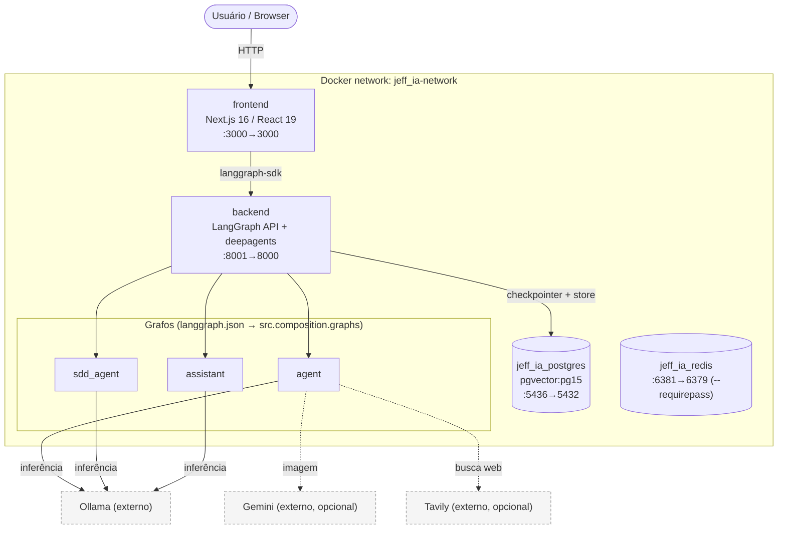

# Arquitetura Jeff AI — Documento de Referência (Baseline as-is)

> **Fonte da verdade:** artefato `arquitetura-jeff-ai-baseline` no OpenSddRag (projeto `jeff-ai`),
> sempre atualizado pelo fluxo SDD. Este arquivo é um **espelho versionado em git** — se ele
> divergir do baseline, deve ser atualizado para refleti-lo.
> Produzido pela mudança `mapear-arquitetura-projeto`; Seção 6 pela `adotar-ddd-clean-architecture`.
>
> **Seções:** 1. Agentes e Grafos LangGraph · 2. Persistência e Backends ·
> 3. Diagrama de Componentes · 4. Integrações e Modelos · 5. Riscos e Dívidas Técnicas ·
> 6. Arquitetura em Camadas (Clean Architecture + DDD).

## 1. Agentes e Grafos LangGraph

O sistema registra **quatro grafos** em `backend/langgraph.json` (chave `graphs`), mas eles são,
na prática, **um grafo só**:

```json
"graphs": {
  "unified": "src.composition.graphs:unified",
  "agent": "src.composition.graphs:agent",
  "sdd_agent": "src.composition.graphs:sdd_agent",
  "assistant": "src.composition.graphs:assistant"
}
```

- **`unified`** — o grafo real (`src/agents/unified/agent.py`), construído com
  `create_deep_agent` (`deepagents`): um único system prompt, o conjunto plano de tools
  (`src/tools/`), um único subagente (`image_design_subagent`), e `interrupt_on` calculado
  dinamicamente por `src/agents/unified/tier_config.py:build_interrupt_on()`.
- **`agent`, `sdd_agent`, `assistant`** — **aliases diretos** para o mesmo objeto Python
  compilado: `backend/src/composition/graphs.py` define literalmente `agent = unified`,
  `sdd_agent = unified`, `assistant = unified`. Não são shims nem wrappers — é atribuição do
  mesmo objeto a três nomes adicionais. Mantidos por retrocompatibilidade com valores de
  `assistantId` já salvos no `localStorage` do frontend; remover custaria uma migração de
  configuração client-side por ~zero ganho (três linhas de código).

**Sistema de "modos" removido.** Havia um classificador de 7 modos
(`requirements`/`sdd`/`chat`/`code`/`test`/`git`/`refactor`) com um prompt por modo. Foi
**removido do código** pela change `unified-agent-realignment` (tasks `modes-1`/`modes-2`), não
apenas documentado como quebrado: `classify_mode()`, `mode_detector` e `with_mode()` não existem
mais em `src/agents/unified/agent.py` nem em `src/composition/graphs.py`. Os quatro `graph_id`
sempre rodam o mesmo prompt e o mesmo conjunto de tools; um `configurable["mode"]` enviado por um
frontend antigo é silenciosamente ignorado (nada no grafo lê essa chave).

**Overlay de perfil (`AgentProfile`).** Introduzido pela change `multi-agent-profiles-runtime`:
o grafo continua **um só objeto compilado**, mas cada run pode carregar um
`configurable.profile_id` (UUID de um `AgentProfile` do usuário autenticado). O
`AgentProfileMiddleware` (`src/agents/unified/agent_profile_middleware.py`, registrado em
`build_unified()` logo após `EnvelopeLifecycleMiddleware`) resolve o perfil uma vez por run e
publica um snapshot num contextvar; a partir dele trocam-se system prompt, `model_override` e o
teto de tools, enquanto `McpToolsMiddleware`, `ScopedSkillsMiddleware` e `memory_tools`
intersectam respectivamente `mcp_allowlist`, `skills_allowlist` e o namespace de memória
(`("memories", user_id, profile_id)`). O `profile_id` **nunca** vem do cliente sem validação: é
carimbado no servidor em `@auth.on.threads.create_run` e em
`LangGraphDirectAgentRunner._build_run_config`, do mesmo modo que `user_key`/`role`. O overlay é
sempre **restritivo** — nunca concede tool que `role` ou envelope bloqueiem — e **não** recompila
`interrupt_on`: um perfil `tier=4` continua pausando em Tier 3+. Sem `profile_id` o comportamento
é idêntico ao anterior. Não há grafo, subagente nem modo por perfil.

**Subagentes.** `_UNIFIED_SUBAGENTS` contém exatamente `image_design_subagent` (contexto
isolado, geração de imagem sem gate de aprovação, memória de estilo por thread — a única exceção
legítima a subagente neste produto, ver harness rule `skill-or-mcp-never-subagent`). O antigo
`fullstack_subagent`, os 7 subagentes de SDD (`src/agents/sdd/subagents/`),
`requirements_specialist.py`, `sdd/orchestrator.py` e `src/agents/assistant/` já foram
**removidos do repositório** — não é código legado "ainda em disco", eles simplesmente não
existem mais: `backend/src/agents/` hoje contém só `unified/` e `subagents/` (com um único
arquivo, `image_design.py`); a remoção está registrada no próprio comentário de
`unified/agent.py` acima de `_UNIFIED_SUBAGENTS`. SDD e geração de requisitos hoje são entregues
como skills (`backend/skills/{sdd,requirements}/SKILL.md`), não subagentes.

## 2. Persistência e Backends

**Duas camadas independentes:** (a) persistência do LangGraph API (checkpointer + store) e
(b) roteamento de filesystem virtual dos agentes via `CompositeBackend`.

### 2.1 Checkpointer e Store (Postgres / pgvector)
Configurados **declarativamente** em [backend/langgraph.json](../backend/langgraph.json), ambos via `POSTGRES_URI`:

```json
"checkpointer": { "type": "postgres", "url": "${env:POSTGRES_URI}" },
"store":        { "type": "postgres", "url": "${env:POSTGRES_URI}" }
```

- **Checkpointer** — histórico/estado do grafo por `thread_id`.
- **Store** — memória de longo prazo (namespace `/memories/`), com busca vetorial pgvector.

> Os agentes **não** instanciam `PostgresSaver` manualmente — o LangGraph API gerencia isso.

### 2.2 CompositeBackend — sistema de arquivos virtual dos agentes
Cada grafo obtém uma `backend_factory(rt)` que monta um `CompositeBackend` (de
`deepagents.backends`) roteando caminhos por thread (`thread_id` via `get_config()`):

- **`agent`** — `default` (`StateBackend`), `{OUTPUTS_DIR}` (`backend/outputs/{thread_id}`), `/skills/`, `/memories/` (`StoreBackend`).
- **`sdd_agent`** — `default`, `{SPECIFY_DIR}` (`outputs/.specify`), `{TEMPLATES_DIR}` (`templates/sdd`), `/skills/`, `/memories/`.
- **`assistant`** — `default`, `{WORKSPACE_DIR}` (`workspace/{thread_id}`), `/skills/` (sem `/memories/`).

> **Resolvido (`adotar-ddd-clean-architecture`):** a `backend_factory`, antes duplicada entre os
> orquestradores (antigo R4), foi unificada em [backend/src/composition/backends.py](../backend/src/composition/backends.py)
> (`make_backend_factory` + `FsRoute`); os três grafos a consomem. Ver Seção 6.

### 2.3 Variáveis de ambiente
Carregadas via `src/composition/env.py:load_env()` a partir de `./.env` (raiz).
Catálogo completo: `./.env.example`. Compose oficiais: `docker-compose.yml`,
`docker-compose.prod.yml`, `docker-compose.all.yml`.

| Variável | Obrigatória | Uso |
|----------|-------------|-----|
| `POSTGRES_URI` | ✅ | Checkpointer + Store (`langgraph.json`) |
| `OLLAMA_BASE_URL` | ✅ | Endpoint do servidor Ollama |
| `OLLAMA_MODEL` | ✅ | Nome do modelo Ollama |
| `BASE_URL` | ⬜ | URL pública do backend (docs/mídia/Evolution) |
| `TAVILY_API_KEY` | ⬜ | Busca web (tool Tavily) |
| `GOOGLE_API_KEY` | ⬜ | Modelo/imagem Gemini |
| `LANGSMITH_API_KEY` | ⬜ | Tracing / debug |

> A leitura de segredos ocorre em infraestrutura/composição/`models`/`tools` — **nunca** em
> `domain`/`application` (garantido pelo import-linter; ver Seção 6).

## 3. Diagrama de Componentes e Fluxo de Dados

Topologia de deploy conforme [docker-compose.yml](../docker-compose.yml) (rede `jeff_ia-network`), portas `host:container`.


```mermaid
flowchart TB
    User([Usuário / Browser])
    subgraph net["Docker network: jeff_ia-network"]
        FE["frontend<br/>Next.js 16 / React 19<br/>:3000→3000"]
        BE["backend<br/>LangGraph API + deepagents<br/>:8001→8000"]
        subgraph graphs["Grafos (langgraph.json → src.composition.graphs)"]
            G1["agent"]
            G2["sdd_agent"]
            G3["assistant"]
        end
        PG[("jeff_ia_postgres<br/>pgvector:pg15<br/>:5436→5432")]
        RD[("jeff_ia_redis<br/>:6381→6379 (--requirepass)")]
    end
    OLL["Ollama (externo)"]
    GEM["Gemini (externo, opcional)"]
    TAV["Tavily (externo, opcional)"]
    User -->|HTTP| FE
    FE -->|langgraph-sdk| BE
    BE --> G1 & G2 & G3
    G1 & G2 & G3 -->|inferência| OLL
    G1 -.->|imagem| GEM
    G1 -.->|busca web| TAV
    BE -->|checkpointer + store| PG
    classDef ext fill:#f5f5f5,stroke:#999,stroke-dasharray:4 3;
    class OLL,GEM,TAV ext;
```

> **Observação:** `jeff_ia_redis` (`REDIS_URI`) está no compose mas não é mencionado no
> `langgraph.json` nem no `CLAUDE.md`; função exata a confirmar — registrado na Seção 5 (R5).

## 4. Integrações e Contornos do Sistema

### 4.1 Runtime do backend
| Modo | Como sobe | Grafos expostos |
|------|-----------|-----------------|
| **Docker** | Imagem oficial `langchain/langgraph-api:3.11` | `LANGSERVE_GRAPHS` (agora `src.composition.graphs:*`) |
| **`langgraph dev`** | CLI lendo `langgraph.json` | `agent`, `sdd_agent`, `assistant` |
| **`server.py`** | FastAPI custom `uvicorn` :8000 | carrega grafos de `langgraph.json` |

O [backend/entrypoint.sh](../backend/entrypoint.sh) registra o assistant `agent` (`graph_id="agent"`) via `POST /assistants`.

### 4.2 Frontend (Next.js) ↔ Backend
Next.js 16 + React 19 + Radix UI + Tailwind; comunicação via `@langchain/langgraph-sdk` →
`LANGSERVE_URL`; config do cliente em `localStorage` (`deep-agent-config`).

### 4.3 Provedores de Modelo (LLM)
| Provedor | Classe | Config | Arquivo |
|----------|--------|--------|---------|
| **Ollama** (default) | `ChatOllama` | `OLLAMA_MODEL`, `OLLAMA_BASE_URL` | `src/models/ollama_model.py` |
| **Gemini** | `ChatGoogleGenerativeAI` / SDK `google.genai` | `GOOGLE_MODEL`/`GOOGLE_API_KEY` | `src/models/gemini_model.py`, `src/infrastructure/llm/gemini_image_adapter.py` |

### 4.4 MCP OpenSddRag
Servidor MCP `opensddrag` (http://localhost:8000, `.mcp.json`) para SDD com memória semântica.
Projeto slug: `jeff-ai`. **Este documento é um artefato produzido por esse fluxo.**

## 5. Riscos e Dívidas Técnicas

| # | Risco / Dívida | Localização | Impacto |
|---|----------------|-------------|---------|
| R1 | **`DATABASE_URL` hardcoded** — não usa `POSTGRES_URI` | `backend/server.py:27` | quebra fora do compose; credenciais no código |
| R2 | **`LANGSERVE_GRAPHS`** vs `langgraph.json` — fonte dupla de registro de grafos | `Dockerfile.backend` vs `langgraph.json` | ambos apontam para `src.composition.graphs`, mas a duplicidade persiste |
| R3 | **`server.py` custom não usado pelo compose** | `backend/server.py` | código alternativo/potencialmente morto |
| ~~R4~~ | **RESOLVIDO** (`adotar-ddd-clean-architecture`) — `backend_factory` unificado em [backend/src/composition/backends.py](../backend/src/composition/backends.py) (`make_backend_factory` + `FsRoute`); os três grafos o consomem | `composition/backends.py` | rota de backend com fonte única — ver Seção 6 |
| R5 | **Serviço `jeff_ia_redis` não documentado** | `docker-compose.yml:13,74-82` | função incerta (fila/cache?) |
| R6 | **Default de `OLLAMA_MODEL` divergente** entre camadas | `ollama_model.py` vs `docker-compose.yml` vs `CLAUDE.md` | modelo efetivo imprevisível |
| R7 | **Credenciais Postgres fixas + CORS `*`** | `docker-compose.yml`, `langgraph.json`, `server.py` | inseguro para exposição externa |
| R8 | **`gemini_model` definido mas não referenciado** pelos grafos ativos | `src/models/gemini_model.py` | fallback não-cabeado ou código morto |

**Recomendação geral:** priorizar R1–R3 (corretude/deploy) antes de R5–R8 (higiene).
R4 já resolvido (ver Seção 6).

## 6. Arquitetura em Camadas (Clean Architecture + DDD)

> Introduzida pela mudança `adotar-ddd-clean-architecture`. O backend saiu de uma estrutura
> **plana** (`agents`/`tools`/`models`) para **4 camadas** guiadas pela **Regra da Dependência**
> (as dependências apontam para dentro), enforçada automaticamente por `import-linter`.

### 6.1 Camadas (`backend/src/`)

| Camada | Diretório | Responsabilidade | Pode importar |
|--------|-----------|------------------|---------------|
| **Domínio** | [`src/domain/`](../backend/src/domain/) | Entidades, value objects e domain services PUROS (linguagem ubíqua) | nada de framework/I/O (só stdlib) |
| **Aplicação** | [`src/application/`](../backend/src/application/) | Casos de uso + `ports` (interfaces) | `domain` |
| **Infraestrutura** | [`src/infrastructure/`](../backend/src/infrastructure/) | Adapters que implementam os ports (LLM, persistência, filesystem) | `application`, `domain` |
| **Composição** | [`src/composition/`](../backend/src/composition/) | Montagem dos grafos + injeção de adapters | todas as camadas internas |

Fluxo de dependência: `composition → infrastructure → application → domain` (setas para dentro).

### 6.2 Enforcement (import-linter)
Configurado em [backend/pyproject.toml](../backend/pyproject.toml) (`[tool.importlinter]`):
- Contrato `layers` — as 4 camadas na ordem canônica.
- Contrato `forbidden` — o núcleo (`domain` + `application`) não pode importar
  `langgraph`/`deepagents`/`langchain_*`/`psycopg`.

Rodar: `make arch` a partir de `backend/` (gate no [backend/Makefile](../backend/Makefile)).

### 6.3 Mapeamento dos verticais migrados

11 verticais de negócio hoje têm `domain/` próprio; a tabela agrupa cada um com sua camada de
aplicação (use cases + ports) e adapters de infraestrutura. `domain/shared` é transversal (usado
por todos, sem use case próprio) e fica fora da tabela, listado à parte.

| Vertical | Domínio (`src/domain/`) | Aplicação (`src/application/`) | Infra (`src/infrastructure/`) | Tool/borda deepagents |
|----------|--------------------------|----------------------------------|----------------------------------|------------------------|
| **Imaging** | `imaging/` — `ImageDesign`, `DesignStyle`, `ImageReference`, `style_consistency` | `use_cases/plan_and_create_image.py` + `ports/{image_gen,style_repository,reference_image_fetch}.py` | `llm/gemini_image_adapter.py`, `persistence/store_style_repository.py`, `media/*`, `web/httpx_reference_image_fetch.py`, `web/images_router.py` | `create_image_from_prompt` |
| **Requirements** | `requirements/` — `RequirementDocument`, `DocumentSection`, `merge` | `use_cases/generate_requirements_document.py` + `ports/document_sink.py` | `filesystem/filesystem_document_sink.py` | `merge_generated_files` |
| **SDD** | `sdd/` — `Feature`, `FeatureNumber`, `Phase`, `pipeline`, `validation` | `use_cases/get_next_feature_number.py` + `ports/sdd_artifact_store.py` | `filesystem/filesystem_sdd_artifact_store.py` | `get_next_feature_number` / `get_sdd_state` / `validate_artifact` |
| **Documents** (Office/PDF) | `documents/` — `blocks`, `blocks_to_html`, `document_content`/`result`/`spec`, `{docx,pptx,xlsx,pdf}_spec`, `embed_css`, `html_sanitizer`, `markdown_table`, `read_limits` | `application/documents/resolve_html_document_input.py` + `use_cases/{create_document,preview_html_document,render_html_document}.py` + `ports/{document_writer,html_document_converter}.py` | `documents/*` (`docx_writer`, `pptx_writer`, `xlsx_writer`, `html_{docx,pptx,xlsx}_converter`, `weasyprint_pdf_converter`, `html_template_repository`, `output_target`), `web/documents_router.py` | `create_docx_document`, `create_xlsx_spreadsheet`, `create_pptx_presentation`, `create_pdf_document`, `preview_html_document` |
| **Email** | `email/` — `models` | `use_cases/{connect_email_account,list_email_accounts,get_email_account,update_email_account,update_email_account_config,delete_email_account,send_email,search_emails,list_emails,get_email,classify_email_by_contact,start_gmail_oauth,complete_gmail_oauth}.py` + `ports/{email_repository,email_account_repository}.py` | `email/*` (`imap_client`, `smtp_client`, `gmail_oauth`, `sync_worker`, `email_sync_worker`), `persistence/{email_repository,email_schema}.py`, `web/email_router.py` | (via skills / futuras tools de email) |
| **Channels** (mensageria) | `channels/` — `chat_channel` | `ports/chat_channel.py` + `use_cases/{handle_chat_message,resolve_delivery_target}.py` | `channels/*` (`registry`, `scheduled_channel`, `telegram_channel`, `web_channel`, `whatsapp_channel`), `telegram/*`, `whatsapp/*`, `web/whatsapp_webhook_router.py` | entrega de mensagens (web/Telegram/WhatsApp) |
| **CRM** | `crm/` — `errors`, `followup_scan`, `models`, `next_best_action`, `stagnation` | `use_cases/{create,get,list,update,archive}_crm_{company,contact,deal}.py`, `create_crm_field_definition.py`, `list_crm_field_definitions.py`, `update_crm_field_definition.py`, `create_crm_note.py`, `list_crm_notes.py`, `move_crm_deal.py`, `list_crm_deal_stages.py`, `crm_custom_values.py` + `ports/crm_repository.py` | `persistence/{crm_repository,crm_schema}.py`, `web/crm_router.py` | (via `web/crm_router.py`, sem tool deepagents direta hoje) |
| **Integrations** (link codes / contas conectadas) | `integrations/` — `telegram_link_code`, `whatsapp_link_code`, `user_integration` | `use_cases/{create_telegram_link_code,redeem_telegram_link_code,create_whatsapp_link_code,redeem_whatsapp_link_code,get_user_integration,list_user_integrations,save_user_integration,delete_user_integration}.py` + `ports/{telegram_link_code_repository,whatsapp_link_code_repository,user_integration_repository}.py`, `application/integrations/config_schemas.py` | `persistence/{telegram_link_codes_repository,telegram_link_codes_schema,whatsapp_link_codes_repository,whatsapp_link_codes_schema,user_integrations_repository,user_integrations_schema}.py`, `web/integrations_router.py` | `GET /api/integrations/channel-config` |
| **Scheduling** | `scheduling/` — `scheduled_task` | `use_cases/{create,cancel,list,update,run}_scheduled_task.py`, `complete_scheduled_task_after_resume.py` + `ports/{scheduled_task_repository,task_scheduler}.py` | `scheduling/*` (`apscheduler_task_scheduler`, `complete_after_resume`, `scheduler_instance`), `persistence/{scheduled_task_repository,scheduled_tasks_schema}.py`, `web/scheduling_router.py` | agendamento de tarefas |
| **MCP** (servidores configurados pelo usuário) | `mcp/` — `mcp_server_config` | `application/mcp/mcp_server_schema.py` + `ports/mcp_server_repository.py` | `persistence/mcp_server_repository.py` | configuração de MCP servers |
| **Agents** (perfis de agente) | `agents/` — `AgentProfile`, `errors` (`DuplicateAgentProfileError`, `InvalidAgentProfileError`, `InvalidModelOverrideError`) | `use_cases/{create,get,list,update,archive}_agent_profile.py` + `ports/agent_profile_repository.py` | `persistence/{agent_profile_repository,agent_profiles_schema}.py`, `web/agent_profiles_router.py` | overlay per-run via `agents/unified/agent_profile_middleware.py` (`configurable.profile_id`); CRUD em `/api/agent-profiles` |

**Transversal:** `domain/shared/errors.py` — tipos de erro comuns, usados por todos os verticais
acima; sem use case ou adapter próprio.

**Infraestrutura sem vertical de domínio dedicado** (plataforma/composição-adjacente —
`src/infrastructure/` tem 17 subdiretórios ao todo. **11** já apareceram na tabela acima (`llm`,
`persistence`, `media`, `web`, `filesystem`, `documents`, `email`, `channels`, `telegram`,
`whatsapp`, `scheduling`) — note que `web/` está contado aqui porque hospeda os routers
específicos de vertical citados nas linhas da tabela (`documents_router.py`, `email_router.py`,
`crm_router.py`, `whatsapp_webhook_router.py`, `integrations_router.py`, `scheduling_router.py`,
`images_router.py`, `agent_profiles_router.py`), embora também contenha arquivos de plataforma sem
dono único (`webapp.py`, `url_safety.py`, `delivery_tokens.py`, `media_delivery_router.py`,
`admin_users_router.py`). Os **6 restantes**, sem nenhuma linha na tabela, são puramente
transversais:
`agent_runtime/` (plumbing do runtime do grafo: checkpoint schema, `langgraph_direct_runner`),
`attachments/` (schema + store de anexos de chat, compartilhado por todos os canais),
`auth/` (usuários, sessões, segurança — plataforma, não um vertical de negócio),
`cli/` (`jeff_cli.py`, entrypoint bare-metal),
`ownership/` (`path_guard`, `paths`, `session_writers`, `store`, `tool_path_guard` — sandbox de
arquivos por sessão, usado por todas as tools de arquivo),
`usage/` (tracking de uso/billing, transversal).

### 6.4 Composição e grafos
- [`composition/dependencies.py`](../backend/src/composition/dependencies.py) — **fiação manual (DI)**: fábricas que injetam os adapters concretos nos use cases. Trocar um adapter muda só este módulo (domínio/use cases intactos).
- [`composition/graphs.py`](../backend/src/composition/graphs.py) — **entrypoint canônico** expondo `agent`, `sdd_agent`, `assistant`. Referenciado por [backend/langgraph.json](../backend/langgraph.json) e `Dockerfile.backend` via `src.composition.graphs:<graph>` (os `graph_id` foram preservados).
- [`composition/backends.py`](../backend/src/composition/backends.py) — `backend_factory` unificado (`make_backend_factory` + `FsRoute`) — **resolve o R4**.

> **Escopo/migração:** `create_deep_agent`/system prompts permanecem em `src/agents/*` (também
> camada de composição, não relocados por baixo churn); `src/tools` e `src/models` seguem **fora**
> dos contratos de camada por ora. Migração incremental (estilo strangler); verticais imaging,
> requirements e sdd concluídos.
